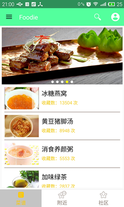
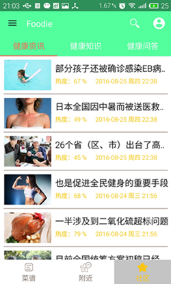
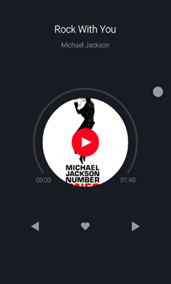
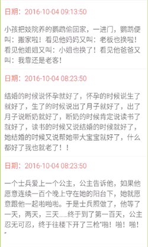
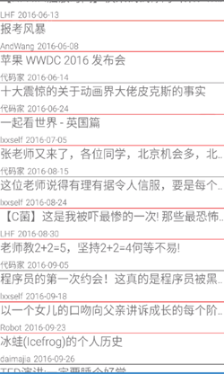
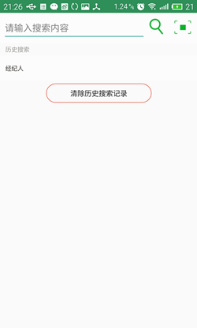
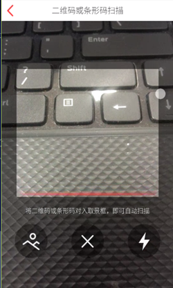

## 项目开发背景
出于学习的精神，采用天狗云数据接口与干活集中营数据接口实现的一款健康与娱乐软件。

## 项目介绍
厨神菜谱APP，不仅仅是一个介绍菜谱的APP，他是一个集健康菜谱，健康资讯，健康问答为主体，同时又具有播放视频功能，播放音乐功能，图片浏览功能，段子查看的功能。让你能够在成为健康厨神的路上不缺乏乐趣！

## 目前实现的功能展示
- **菜谱、详情**
-  

- **社区**
- 

- **娱乐功能**
-    

- **部分小功能**
- 
- 

## 技术实现
- 技术实现
    + 采用xUtils3框架加载网络数据
    + 采用多个 Activity + 多个 Fragment 实现页面内容
    + 使用 RecyclerView + SwipeRefreshLayout 实现添加头部和底部，同时实现数据的下拉刷新和上拉加载数据
    + 采用zxing框架实现扫描功能
    + 采用butterknife框架绑定数据
- 接口问题
    + 最近可能是天狗云数据中心在维护吧，所以主页还有社区的内容都加载不上来。

## 接口
- 主页以及社区功能调用天狗云的数据
- 娱乐功能采用的是干货集中营的API

## 感谢
项目中用到了很多开源库和参考了很多开源作者的源码，当时只顾着实现功能忘记记录了。如果其中有侵犯到个人版权及隐私的请联系我删除！最后，真的非常感谢开源的各个大神！

