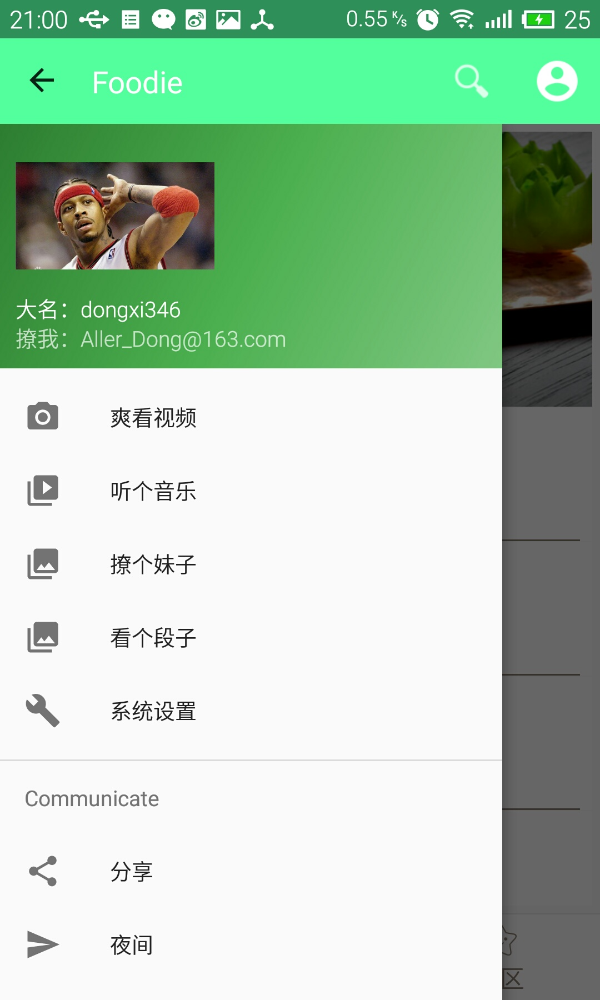

## 项目开发背景
这个项目原来是在原本的吃货宝团购APP上改变而来，而吃货宝团购APP由于自己对后台数据的学习不是很透彻，不能实现后台的大部分功能，于是在原有的基础上，再根据自己目前学习Android的情况，做出了这个厨神菜谱APP。（原本的吃货宝APP做的超级烂被我狠心抛弃了，虽然这个做的也很烂，哈哈！）

## 项目介绍
厨神菜谱APP，不仅仅是一个介绍菜谱的APP，他是一个集健康菜谱，健康资讯，健康问答为主体，同时又具有定位功能，播放视频功能，播放音乐功能，浏览图片，查看段子的功能。让你能够在成为健康厨神的路上不缺乏乐趣！

## 目前实现的功能展示
- 菜谱
- 
- 
- 附近
- 
- 社区
- 
- 娱乐功能
- 
- 部分小功能
- 
- 

## 菜谱模块
- 描述
    + 用户可以通过点击每一个菜谱查看菜谱的详细信息，同时可以通过下拉刷新和下拉加载
- 技术实现
    + 使用图片轮播显示热搜索的图片
    + 使用 RecyclerView + SwipeRefreshLayout 实现添加头部和底部，同时实现数据的下拉刷新和上拉加载数据

## 附近模块
- 可以通过定位实现附近美食的搜索和显示
- 扫一扫
二维码扫描闪光灯、打开本地图片，能扫描条形码，创建二维码且能添加头像
- 摇一摇（摆设）

## 社区
新闻、知识、问答的阅读，可以调节字体大小，可以分享
- 健康资讯
    + 提供关于健康的新闻阅读
- 健康问答
    + 提供关于健康的问答阅读
- 健康知识
    + 提供关于健康的知识阅读

##　娱乐功能
- 视频爽看
    + 视频播放
- 听个音乐 
    + 播放音乐
- 看个段子
    + 阅读笑话
- 系统设置
    + 清理缓存
    + 版权信息
    + 关于我们
    + 退出登录

- 分享
    + 由于还要在各个平台注册开发，创建应用太麻烦了。。我只实现了QQ分享，其他分享也是一样的道理

- 夜间模式（未实现）

## 部分小功能
- 记录历史搜索功能
    + 记录用户最近输入的5条记录，可以清除历史记录
    + 同时搜索能实现百度搜索
- 优美的注册登录效果

## 接口
- 调用天狗云的数据平台菜品的采集
- 手机号验证调用的是Mob的数据验证
- 百度开放平台实现地图功能
- ShareSDK开放平台实现分享功能
- 娱乐功能采用的是干货集中营的API

## 感谢
项目中用到了很多开源库和参考了很多开源作者的源码，当时只顾着实现功能忘记记录了。如果其中有侵犯到个人版权及隐私的请联系我删除！最后，真的非常感谢开源的各个大神！

